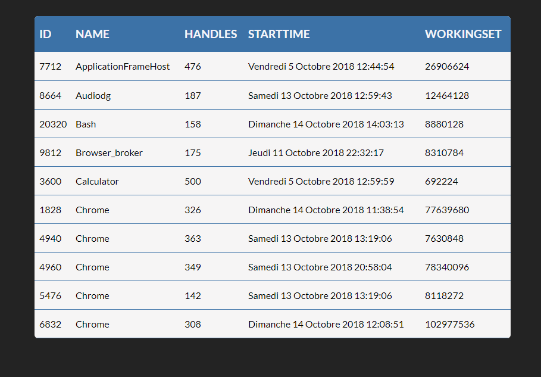

## Learning by doing

The easiest way to get a grasp of how to use PSHTML is to check out the [Examples](../PSHTML/Examples). Find below a few examples to play with.

## Templates

Since version 0.4 it is possible to build websites using templates. The following example showcase how this works:

```Example04/Example04.ps1``` contains the following sample code:

### Example04/Example04.ps1

```powershell


html{
    Header{
        h1 "This is an example generated using PSHTML Templates"
    }
    Body{

        include -name Body

    }
    Footer{
        Include -Name Footer
    }
}

```

Assuming that ```Example4/body.ps1``` and ```Example/Footer.ps1``` contains the following ```pshtml```code:

### body.ps1

```powershell

    h2 "This comes from a template file"

```

### footer.ps1

```powershell
div {
    h4 "This is the footer from a template"
    p{
        "Copyright from template"
    }
}
```

Would generate the following code:

```html

    <header>
        <h1>This is an example generated using PSHTML Templates</h1>
    </header>
    <body>
        <h2>This comes from a template file</h2>
    </body>
    <footer>
        <div>
            <h4>This is the footer from a template</h4>
        </div>
    </footer>
</html>

```
## Generating a (very) basic form

```PowerShell
form "MyPage.php" post _self -Content {

    input "text" "FirstName"
    input "text" "LastName"
    input submit "MySubmit"
}
```

Which generates the following code:

```html
<form action="MyPage.php" method="post" target="_self" >
    <input type="text" name="FirstName" >
    <input type="text" name="LastName" >
    <input type="submit" name="MySubmit" >
</form>
```
## Generating a HTML Table

```PowerShell
$proc = Get-Process | Select-Object -Skip 8 -First 10
$css = 'body{background:#252525;font:87.5%/1.5em Lato,sans-serif;padding:20px}table{border-spacing:1px;border-collapse:collapse;background:#F7F6F6;border-radius:6px;overflow:hidden;max-width:800px;width:100%;margin:0 auto;position:relative}td,th{padding-left:8px}thead tr{height:60px;background:#367AB1;color:#F5F6FA;font-size:1.2em;font-weight:700;text-transform:uppercase}tbody tr{height:48px;border-bottom:1px solid #367AB1;text-transform:capitalize;font-size:1em;&:last-child {;border:0}tr:nth-child(even){background-color:#E8E9E8}'

html {
    head { 
        style {
            $css
        }
    }
    body {
        ConvertTo-HTMLtable -Object $proc -Inline -properties Id, Name, Handles, StartTime, WorkingSet
    }
}  | Out-File 'C:\temp\Example-ConvertTo-HTMLtable.html'
```
Which generate the following HTML page :



# Dynamic pages:

It is possible to couple PSHTML with other cool technologies such as nodejs or Polaris.

Read the [following example](/hands-on/PSHTMLwithPowerShell.md) on how to do this (Thanks to [chen](https://github.com/ChendrayanV)!!)